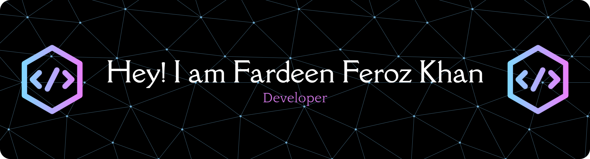

    

<h4 align="center">I'm an aspiring developer in areas like machine learning, web, AI tools. My journey in technology is driven by a desire to build efficient solutions to a variety of problems. I believe in the power of code to create positive change and love collaborating with others to bring new ideas to life..</h4>

🌱 I’m currently learning **Backend Dev**

📫 How to reach me: **fardeenferozkhan16@gmail.com**

<h3 align="left">Connect with me:</h3>

<h3 align="left">Languages and Tools:</h3>

<!--
**vinpatrol/vinpatrol** is a ✨ _special_ ✨ repository because its `README.md` (this file) appears on your GitHub profile.

Here are some ideas to get you started:

- 🔭 I’m currently working on ...
- 🌱 I’m currently learning ...
- 👯 I’m looking to collaborate on ...
- 🤔 I’m looking for help with ...
- 💬 Ask me about ...
- 📫 How to reach me: ...
- 😄 Pronouns: ...
- ⚡ Fun fact: ...
-->

    

